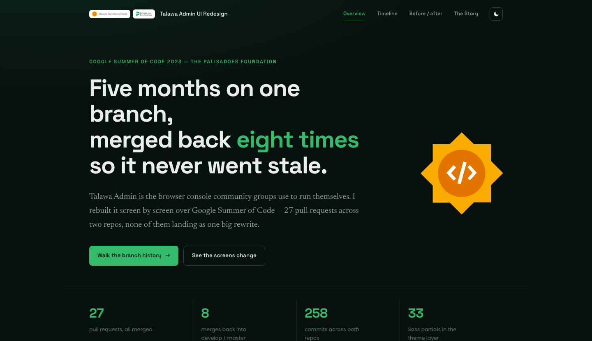

# Talawa Admin UI Redesign — GSoC 2023



Case study of my Google Summer of Code 2023 work with The Palisadoes
Foundation, redesigning the admin UI for Talawa. Built from the actual PR
history of `talawa-admin` and `talawa-api`.

Live at [gsoc.rishavjha.com](https://gsoc.rishavjha.com).

## Stack

- Next.js (App Router), static export
- TypeScript
- Plain CSS, no framework

## Running it

```bash
npm install
npm run shots   # pulls PR screenshots into public/shots, run once
npm run dev
```

Open http://localhost:3000.

```bash
npm run build   # static output in ./out
```

Node 18+.

## Structure

- `app/` — pages: overview, timeline, before/after, write-up
- `components/` — GitGraph (the branch/merge timeline), BeforeAfter slider,
  gallery + lightbox, nav
- `lib/data.ts` — the PR dataset
- `scripts/fetch-shots.mjs` — downloads screenshots from GitHub

## License

MIT — see [LICENSE](LICENSE).
